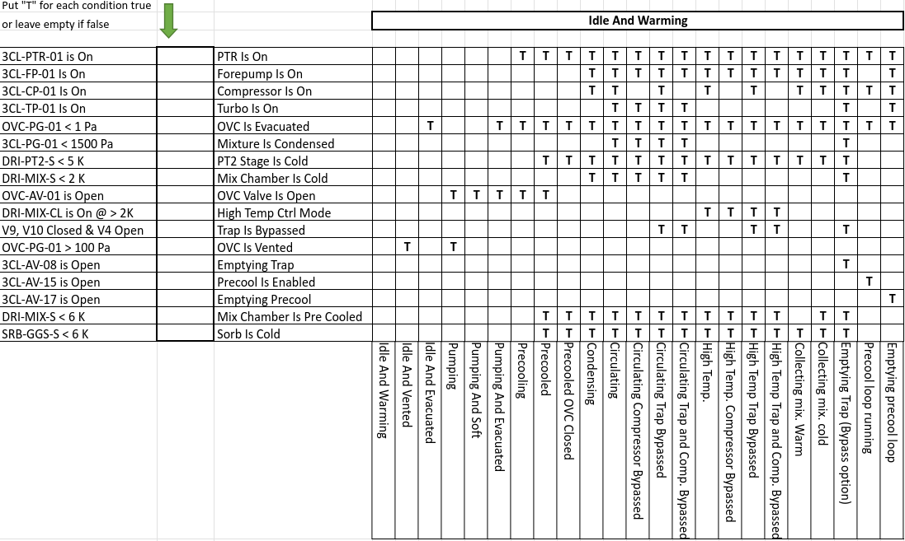

Proteox controller
==================

High-level controller for the Proteox cryostat system by Oxford Instruments, interfacing via WAMP.

To configure the connection, you must include a ``.env`` file in the same folder as the Proteox module. This file must contain the following entries:

.. code-block:: bash

   WAMP_USER="**********"
   WAMP_USER_SECRET="*************"
   WAMP_REALM="ucss"
   WAMP_ROUTER_URL="ws://************:8080/ws"
   BIND_SERVER_TO_INTERFACE="localhost"
   SERVER_PORT="33576"

.. warning::

   All API methods (including sensor accessors and recognized-state helpers) are asynchronous and must be used with ``await`` inside an async function.

Example of operations
"""""""""""""""""""""

.. code-block:: python

   from asyncio import run
   from qtics import Proteox

   async def myfun():
       instrument = Proteox()
       await instrument.connect()

       mix = await instrument.get_MC_T()
       pt1 = await instrument.get_PT1_T1()
       pt2 = await instrument.get_PT2_T1()
       sti = await instrument.get_STILL_T()
       col = await instrument.get_CP_T()

       print("\nTEMPS:")
       print(f"MIX: {mix*1000:.2f} mK")
       print(f"STILL: {sti*1000:.2f} mK")
       print(f"COLD: {col*1000:.2f} mK")
       print(f"PT1: {pt1:.2f} K")
       print(f"PT2: {pt2:.2f} K")

       await instrument.close()

   run(myfun())

Commands
--------

* **connect()**

  Connect to the Proteox cryostat via WAMP.

* **close()**

  Cleanly disconnect from the cryostat session.

* **get_<sensor>()**

  Dynamic getter for supported sensors (see below).
  If the key is not recognized, raises an ``AttributeError``.

* **set_<attribute>(<value>)**

  Dynamic setter for supported control parameters (see below).
  If the key is not recognized, raises an ``AttributeError``.

* **is_in_recognized_state()**

  Return ``True`` if the current cryostat conditions match one of the recognized exclusive states.

* **get_recognized_states()**

  Return a list of recognized states currently matched.
  In normal operation this should usually contain **zero or one** state, because matching is implemented as **exclusive**.

* **how_to_go_to_recognized_state(target_state=None)**

  Return a human-readable suggestion describing what conditions are missing or conflicting in order to reach:

  - the **closest recognized state**, if ``target_state`` is ``None``
  - a **specific recognized state**, if ``target_state`` is provided

Dynamic getters
---------------

The following sensors are available via dynamic getter methods:

Temperatures
^^^^^^^^^^^^

* ``get_SAMPLE_T()`` – Sample thermometer
* ``get_MC_T()`` – Mixing chamber temperature
* ``get_MC_T_SP()`` – Mixing chamber temperature setpoint
* ``get_STILL_T()`` – Still temperature
* ``get_CP_T()`` – Cold plate temperature
* ``get_SRB_T()`` – Sorb temperature
* ``get_DR2_T()``, ``get_DR1_T()`` – DR stage temperatures
* ``get_PT2_T1()``, ``get_PT1_T1()`` – Pulse tube stage temperatures
* ``get_MAG_T()`` – Magnet system temperature

Heaters and Powers
^^^^^^^^^^^^^^^^^^

* ``get_MC_H()`` – Mixing chamber heater power
* ``get_STILL_H()`` – Still heater power

Pressures
^^^^^^^^^

* ``get_OVC_P()`` – Outer vacuum chamber pressure
* ``get_P1_P()`` to ``get_P6_P()`` – Various pressure gauges

Flows
^^^^^

* ``get_3He_F()`` – :sup:`3`He flowmeter

Magnetic Field Control
^^^^^^^^^^^^^^^^^^^^^^

* ``get_MAG_VEC()`` – Magnetic field vector
* ``get_MAG_STATE()``, ``get_SWZ_STATE()`` – Magnet controller and sweep state
* ``get_MAG_TARGET()`` – Field target
* ``get_MAG_X_STATE()``, ``get_MAG_Y_STATE()``, ``get_MAG_Z_STATE()`` – Axis state
* ``get_MAG_CURR_VEC()``, ``get_CURR_TARGET()`` – Magnet current vector and targets

Cryostat State
^^^^^^^^^^^^^^

* ``get_state()`` – Cryostat state (returns descriptive label, e.g. ``"CONDENSING"``)

Available state labels:

* ``IDLE``
* ``PUMPING``
* ``CONDENSING``
* ``CIRCULATING``
* ``WARM UP``
* ``CLEAN COLD TRAP``
* ``SAMPLE EXCHANGE``

Dynamic setters
---------------

The following control parameters are available via dynamic setter methods.
Each setter corresponds to a WAMP procedure call and must be awaited.

Example
"""""""

.. code-block:: python

   # Change the mixing chamber setpoint and heater power
   await instrument.set_MC_T(0.1)   # set MC temperature setpoint to 100 mK

.. note::

   Temperature values are expected in **kelvin**.

Temperature and Heater Control
^^^^^^^^^^^^^^^^^^^^^^^^^^^^^^

* ``set_MC_T(value)`` – Set mixing chamber temperature setpoint
* ``set_MC_H(value)`` – Set mixing chamber heater power
* ``set_MC_H_OFF(value=0)`` – Turn off mixing chamber heater
* ``set_STILL_H(value)`` – Set still heater power
* ``set_STILL_H_OFF(value=0)`` – Turn off still heater

Magnet Control
^^^^^^^^^^^^^^

* ``set_MAG_TARGET(value)`` – Set magnetic field target (vector or scalar depending on mode)
* ``set_MAG_STATE(value)`` – Set magnet controller state
* ``set_MAG_X_STATE(value)``, ``set_MAG_Y_STATE(value)``, ``set_MAG_Z_STATE(value)`` – Set state for each magnet axis

.. note::

   Setter operations must always be awaited.
   Example: ``await instrument.set_MAG_STATE("SWEEP")``

Recognized states
-----------------

The Proteox driver also provides a **recognized-state evaluator**.

This system compares a set of measured cryostat conditions (pressures, temperatures, valve states, pumps, etc.) against an internal **exclusive truth table** of known operational states.

This is useful to:

- check whether the cryostat is currently in a valid known configuration
- identify the current recognized operating state
- determine the **closest valid state**
- obtain a list of suggested actions to reach a target state

Recognized state table
^^^^^^^^^^^^^^^^^^^^^^

The state recognition logic is based on the following operational truth table:

.. note::

   Matching is **exclusive**.

   This means that a state is considered matched only if:

   - all conditions expected to be **True** are actually True
   - all conditions expected to be **False** are actually False

   In other words, extra active conditions can invalidate a state match.

Available high-level methods
^^^^^^^^^^^^^^^^^^^^^^^^^^^^

You can access the recognized-state API directly from the ``Proteox`` object.

**Check whether the current state is recognized**

.. code-block:: python

   ok = await instrument.is_in_recognized_state()
   print(ok)

Example output:

.. code-block:: text

   True

**Get the currently recognized state(s)**

.. code-block:: python

   states = await instrument.get_recognized_states()
   print(states)

Example output:

.. code-block:: text

   ['Circulating Compressor Bypassed']

**Get instructions to reach the closest recognized state**

.. code-block:: python

   suggestion = await instrument.how_to_go_to_recognized_state()
   print(suggestion)

Example output:

.. code-block:: text

   Closest target state: 'Circulating'
   Total mismatches: 1

   Required actions:
    - 3CL-CP-01 is On -> Turn ON compressor (3CL-CP-01).

**Get instructions to reach a specific recognized state**

.. code-block:: python

   suggestion = await instrument.how_to_go_to_recognized_state("Circulating")
   print(suggestion)

Example output:

.. code-block:: text

   Target state: 'Circulating'
   Total mismatches: 1

   Required actions:
    - 3CL-CP-01 is On -> Turn ON compressor (3CL-CP-01).

Full example
^^^^^^^^^^^^

.. code-block:: python

   from asyncio import run
   from qtics import Proteox

   async def myfun():
       instrument = Proteox()
       await instrument.connect()

       ok = await instrument.is_in_recognized_state()
       print("Recognized:", ok)

       states = await instrument.get_recognized_states()
       print("Matched states:", states)

       suggestion = await instrument.how_to_go_to_recognized_state()
       print("\nClosest-state suggestion:")
       print(suggestion)

       suggestion_specific = await instrument.how_to_go_to_recognized_state("Circulating")
       print("\nHow to reach 'Circulating':")
       print(suggestion_specific)

       await instrument.close()

   run(myfun())

Internal recognized-state manager
^^^^^^^^^^^^^^^^^^^^^^^^^^^^^^^^^

The ``Proteox`` object internally exposes a recognized-state manager:

.. code-block:: python

   instrument.recognized_states

This helper is mainly useful for advanced debugging, diagnostics, or future GUI integration.

It currently supports internal methods such as:

* ``evaluate_conditions()``
* ``get_condition_report()``
* ``match_all_states()``
* ``get_closest_state()``
* ``get_state_gap(target_state)``
* ``get_transition_plan(target_state=None)``

These methods are generally intended for advanced users and internal tooling rather than routine control scripts.

Typical usage pattern
^^^^^^^^^^^^^^^^^^^^^

A practical workflow is:

1. read the current cryostat status
2. check whether it is recognized
3. if not, ask for the nearest valid state
4. optionally request how to reach a specific target state

Example:

.. code-block:: python

   ok = await instrument.is_in_recognized_state()

   if not ok:
       print(await instrument.how_to_go_to_recognized_state())

This is especially useful when building:

- monitoring dashboards
- operator guidance tools
- automated safety or recovery procedures
- state-aware experiment orchestration
